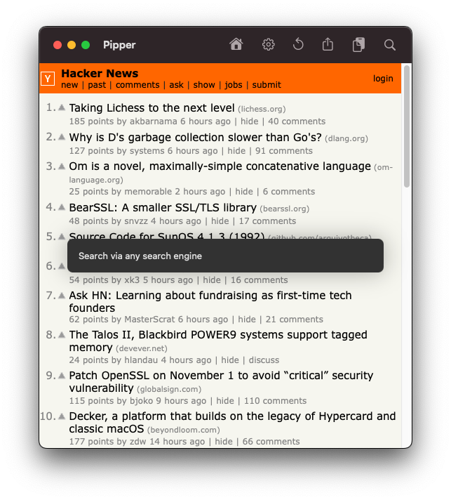

# Pipper
Just a webview in a window configured to be floating over other apps. 
I sometimes like to have a window stay always visible on screen, so I did this. 
If you have an ultrawide monitor I am sure you can understand!

## Use Cases
### MOTU AVB Mixer
Thanks to James Steele from the MOTUnation [Forum](https://www.motunation.com/forum/index.php) and [YouTube Channel](https://www.youtube.com/user/MOTUNATION) for showing how Pipper can be used with the MOTU AVB Mixer [in this video](https://www.youtube.com/watch?v=uZrAAGjKsAI).

### Audio Monitoring
While Pipper can't access your mac Microphone or Camera (for now at least), you can setup a local webserver to do so, and use pipper to display informations.

For an example of this see [this Python script](https://github.com/curzel-it/pipper/blob/main/docs/use-cases/audio-reporting/audio_reporting.py).

## Features
* Bookmark any URL for quick access
* Search text with `CMD + Shift + F`
* Search text from clipboard with `CMD + Shift + V`
* Configurable User Agent
* Configurable Search Engine
* Floats over other windows (can be disabled)
* Supports multiple windows
* No tracking

## Gallery

## Install and Run
Latest build is available in Releases, to build from source:

1. Clone the project
1. Launch with Xcode
1. Wait for SPM to resolve dependencies
1. Run `Pipper` target
 
